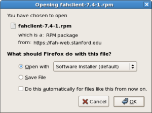

Installation
============

.. contents::
   :local:

Overview
--------

This section describes the recommended method for installing the V7 FAH software for an individual client slot using a software package in Linux. A first time installation is assumed. And unless otherwised noted, the default setting for each option is the recommended setting.

Requirements
------------

This document assumes root access to the system.

Installation for Debian, Mint, and Ubuntu
-----------------------------------------

Identify and Download the Latest F@H Version
********************************************
Note: GUI based installation of the packages is not supported and will return the following error in the Ubuntu Software Store::

	Failed to install file: not supported

#. Navigate to https://foldingathome.org/alternative-downloads/
#. Right click the deb links, and select 'Copy Link Location'
#. Download the latest identified F@H version to your local machine::

	su root
        cd [Downloads_Directory]
        wget https://download.foldingathome.org/releases/public/release/fahclient/debian-stable-64bit/[version]/fahclient_[version]_amd64.deb
        wget https://download.foldingathome.org/releases/public/release/fahcontrol/debian-stable-64bit/[version]/fahcontrol_[version]-1_all.deb
        wget https://download.foldingathome.org/releases/public/release/fahviewer/debian-stable-64bit/[version]/fahviewer_[version]_amd64.deb

Install the Packages
********************

1. Install the FAHClient. After the package installs, Folding@Home processes will begin running and consuming CPU cycles::

        apt install ./fahclient_[version]_amd64.deb

Expected Output::

	Reading package lists... Done
	Building dependency tree       
	Reading state information... Done
	Note, selecting 'fahclient' instead of './fahclient_7.6.21_amd64.deb'
	Recommended packages:
	  fahviewer fahcontrol
	The following NEW packages will be installed:
	  fahclient
	0 upgraded, 1 newly installed, 0 to remove and 0 not upgraded.
	After this operation, 9,250 kB of additional disk space will be used.
	Get:1 /home/workstation/Downloads/fahclient_7.6.21_amd64.deb fahclient amd64 7.6.21 [3,266 kB]
	Preconfiguring packages ...
	Selecting previously unselected package fahclient.
	(Reading database ... 296929 files and directories currently installed.)
	Preparing to unpack .../fahclient_7.6.21_amd64.deb ...
	usermod: no changes
	Unpacking fahclient (7.6.21) ...
	Setting up fahclient (7.6.21) ...
	Failed to enable unit: Unit /run/systemd/generator.late/FAHClient.service is transient or generated.

	The Folding@home client is now installed

	You can access the Web interface by going to:

	  https://client.foldingathome.org/

	in a browser on this computer.

	For information about configuring the Folding@home client for 
	remote access please see the comments in:

	  /etc/fahclient/config.xml

	Processing triggers for mime-support (3.64ubuntu1) ...
	Processing triggers for gnome-menus (3.36.0-1ubuntu1) ...
	Processing triggers for systemd (246.6-1ubuntu1.1) ...
	Processing triggers for desktop-file-utils (0.24-1ubuntu4) ...

2. Install the FAHControl application. FAHControl will show “offline” or “connecting” status until the FAHClient is running, either started automatically (strongly recommended) or started manually::

        dpkg -i --force-depends fahcontrol_[version]-1_all.deb

3. Optionally, install the FAHViewer::

        apt install ./fahviewer_[version]_amd64.deb

Expected Output::

	Reading package lists... Done
	Building dependency tree       
	Reading state information... Done
	Note, selecting 'fahviewer' instead of './fahviewer_7.6.21_amd64.deb'
	The following additional packages will be installed:
	  freeglut3 libgl1-mesa-glx
	Recommended packages:
	  fahcontrol
	The following NEW packages will be installed:
	  fahviewer freeglut3 libgl1-mesa-glx
	0 upgraded, 3 newly installed, 0 to remove and 0 not upgraded.
	Need to get 79.6 kB/4,744 kB of archives.
	After this operation, 15.9 MB of additional disk space will be used.
	Do you want to continue? [Y/n] y
	Get:1 /home/workstation/Downloads/fahviewer_7.6.21_amd64.deb fahviewer amd64 7.6.21 [4,665 kB]
	Get:2 http://us.archive.ubuntu.com/ubuntu groovy-updates/main amd64 libgl1-mesa-glx amd64 20.2.6-0ubuntu0.20.10.1 [5,540 B]
	Get:3 http://us.archive.ubuntu.com/ubuntu groovy/universe amd64 freeglut3 amd64 2.8.1-6 [74.0 kB]
	Fetched 79.6 kB in 0s (343 kB/s)    
	Selecting previously unselected package libgl1-mesa-glx:amd64.
	(Reading database ... 301129 files and directories currently installed.)
	Preparing to unpack .../libgl1-mesa-glx_20.2.6-0ubuntu0.20.10.1_amd64.deb ...
	Unpacking libgl1-mesa-glx:amd64 (20.2.6-0ubuntu0.20.10.1) ...
	Selecting previously unselected package freeglut3:amd64.
	Preparing to unpack .../freeglut3_2.8.1-6_amd64.deb ...
	Unpacking freeglut3:amd64 (2.8.1-6) ...
	Selecting previously unselected package fahviewer.
	Preparing to unpack .../fahviewer_7.6.21_amd64.deb ...
	Unpacking fahviewer (7.6.21) ...
	Setting up freeglut3:amd64 (2.8.1-6) ...
	Setting up libgl1-mesa-glx:amd64 (20.2.6-0ubuntu0.20.10.1) ...
	Setting up fahviewer (7.6.21) ...
	Processing triggers for mime-support (3.64ubuntu1) ...
	Processing triggers for gnome-menus (3.36.0-1ubuntu1) ...
	Processing triggers for libc-bin (2.32-0ubuntu3) ...
	Processing triggers for desktop-file-utils (0.24-1ubuntu4) ...

 

Installation for RedHat, CentOS, and Fedora
-------------------------------------------

Identify and Download the Latest F@H Version
********************************************

#. Navigate to https://foldingathome.org/alternative-downloads/
#. Right click the rpm links, and select 'Copy Link Location'
#. Download the latest identified F@H version to your local machine::

        wget https://download.foldingathome.org/releases/public/release/fahclient/centos-[version]-64bit/[version]/fahclient-[version]-1.x86_64.rpm
        wget https://download.foldingathome.org/releases/public/release/fahcontrol/centos-[version]-64bit/[version]/fahcontrol-[version]-1.noarch.rpm
        wget https://download.foldingathome.org/releases/public/release/fahviewer/centos-[version]-64bit/[version]/fahviewer-[version]-1.x86_64.rpm

Install the Packages
********************

#. Install the FAHClient. Note that Fedora / RedHat .rpm packages do not support prompting for setup information. Instead, the client is set to pause on start so initial setup information may be entered through the FAHControl interface::

        rpm -i --nodeps fahclient-[version]-1.x86_64.rpm

#. Install the FAHControl application. Please note that it is not required to install fahcontrol on a headless (non-GUI) system::

        rpm -i --nodeps fahcontrol-[version]-1.noarch.rpm

#. install the FAHViewer. Please note that it is not required to install fahcontrol on a headless (non-GUI) system::

        rpm -i --nodeps fahviewer-[version]-1.x86_64.rpm

Configure config.xml
********************

#. Open the config.xml file::

        vi /etc/fahclient/config.xml

#. Enter the desired configuration. The below example displays identifying a user, team, and 2 CPU cores::

        <config>
          <!-- Folding Slot Configuration -->
          <gpu v='false'/>

          <!-- Slot Control -->
          <power v='light'/>

          <!-- User Information -->
          <passkey v='123456789abcdefg'/>
          <team v='123456'/>
          <user v='First_Last'/>

          <!-- Folding Slots -->
          <slot id='1' type='CPU'/>
          <slot id='2' type='CPU'/>

Configure Systemd Service
*************************

#. Open a new file for F@H::

        vi /etc/systemd/system/FAHClient.service

#. Insert the following text into the file::

        [Unit]
        Description=Folding@home V7 Client

        [Service]
        Type=simple
        User=fahclient
        Group=fahclient
        WorkingDirectory=/var/lib/fahclient
        ExecStart=/usr/bin/FAHClient --config=/etc/fahclient/config.xml --chdir=/var/lib/fahclient/
        PrivateTmp=yes
        Restart=always

        [Install]
        WantedBy=multi-user.target

#. Save the file
#. Start the service::

        systemctl start FAHClient.service

#. Verify service status::

        systemctl status FAHClient.service

Configure Remote Access (Optional)
**********************************

#. Update the /etc/fahclient/config.xml file with the following stanza, while substituting in the IP address you want to allow::

         <!-- Grant remote web access to the following IP -->
         <allow>192.168.1.1</allow>
         <web-allow>192.168.1.1</web-allow>

#. Navigate to the Web Control page to verify access: http://[IP_Address]:7396/

Select the appropriate V7 package for your Linux distribution from the V7 download page. (see figure 1). There are separate installation packages for the new FAHControl (client manager) interface software, the new FAHClient (slot manager) software, and the new FAHViewer (viewer) software. FAHClient is required, FAHControl is recommended, FAHViewer is optional.

.. image:: overview_linux_figures/figure1.png

Figure 1

Click the link for a matching operating system to start the software installation, or click the See all downloads link, and select the appropriate operating system from the full list.

Linux will ask how to handle the package file download (see figure 2).

.. image:: overview_linux_figures/figure2.1.png

Debian / Mint / Ubuntu <– Figure 2 –> Fedora / CentOS / Red Hat

When prompted, click OK to open the package installer.

Note: Some versions of Linux do not have a package installer program listed to open the file directly. The only option is to save the file, and then open the file in the Downloads folder with the software manager. The process is very similar and the rest of the setup is the same.

The Package Installer is displayed (see figure 3).

.. image:: overview_linux_figures/figure3.1.png
.. image:: overview_linux_figures/figure3.2.png

Debian / Mint / Ubuntu <– Figure 3 –> Fedora / CentOS / Red Hat

Click the Install Package or Apply button to continue the installation.

Enter an administrator password when prompted (see figure 4).

.. image:: overview_linux_figures/figure4.1.png
.. image:: overview_linux_figures/figure4.2.png

Debian / Mint / Ubuntu <– Figure 4 –> Fedora / CentOS / Red Hat

The Package Installer prompts for initial setup information in Debian / Ubuntu installs only (see figure 5).

Note: Fedora / Red Hat .rpm packages do not support prompting for setup information. Instead, the client is set to paused so initial setup information may be entered through the FAHControl interface. However, there is a 5 minute time limit on this initial pause.  After that, the client will start and download work using the current default settings.

.. image:: overview_linux_figures/figure5.png

Additional configuration changes are optional and may be skipped. If no changes are made, the client will run with these default settings:

- User Name: Anonymous
- Team Number: 0
- Passkey: None
- Power: Medium
- Start: Automatic

Or enter a Donor Name, Team number, and/or Passkey number. Entering a passkey is recommended but not required. However, a passkey is required to participate in the Quick Return Bonus points system.  For maximum production, change the Power resource setting from medium to ALL.

Note: DO NOT uncheck to box to start the FAHClient automatically.  Starting the FAHClient manually is considered an expert only feature.

Note: Express Installation (ALL) automatically installs a single client slot to match the computer hardware detected. If multiple CPU cores are detected, a multi-core CPU slot is installed. If not, then a single core CPU slot is installed as the fall back option. A GPU slot option is also supported in the Linux client.

Click Forward to continue.

The Package Installer shows installation progress (see figure 6).

.. image:: overview_linux_figures/figure6.1.png
.. image:: overview_linux_figures/figure6.2.png

Debian / Mint / Ubuntu <– Figure 6 –> Fedora / CentOS / Red Hat

Finishing the install will take another minute or two.

Installation is complete (see figure 7).

.. image:: overview_linux_figures/figure7.1.png
.. image:: overview_linux_figures/figure7.2.png

Debian / Mint / Ubuntu <– Figure 7 –> Fedora / CentOS / Red Hat

Click the Close button. The V7 software is installed and running as a service.

Repeat steps 1 – 7 with the FAHControl package, and optionally, the FAHViewer package.

Settings may be updated and progress can be monitored in FAHControl (see figure 8).

.. image:: overview_linux_figures/figure8.1.png
.. image:: overview_linux_figures/figure8.2.png

Debian / Mint / Ubuntu <– Figure 8 –> Fedora / CentOS / Red Hat

The FAHControl application launches.

This is the FAHControl (client manager) interface . The client should display ONLINE and Running (see figure 9).

.. image:: overview_linux_figures/figure9.png

V7 software is now installed and folding.

Please read the V7 Introduction page for basic information and further explanations of the new client features.

See also the FAHControl (client manager), FAHClient (slot), and FAHViewer (viewer) documents for more information about setup and customization options.

While the default options are typically the recommended options, see the Configuration FAQ for additional setup options.
