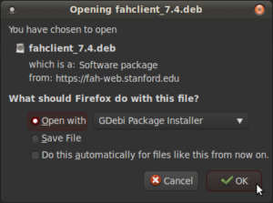
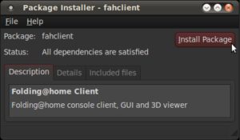
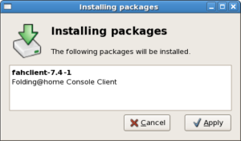
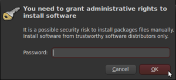
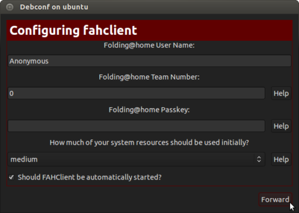
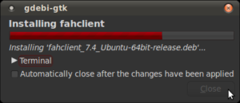
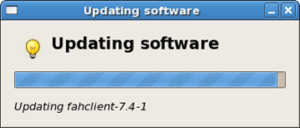
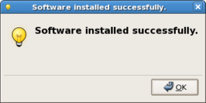
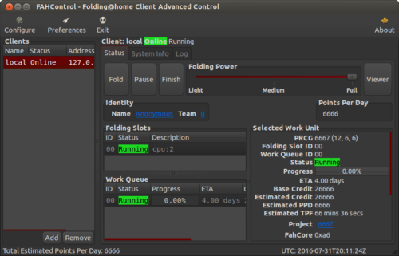

==============
Linux Overview
==============

Introduction to V7
------------------

The new Folding@home (FAH) software is configured, controlled, and monitored through a new simpler graphical interface named Web Control. This new web browser based application has incorporated many new features, including client monitoring and configuration of all FAH clients. Web Control is now the recommended interface for all FAH types (Single core CPU, Multi-core CPU, GPU), replacing both the Systray and the Console versions of FAH.  The more advanced FAHControl application is also available.

New Terminology
----------------

The V7 software really changes the concept of how people interact with FAH. And with new concepts come new or updated terms to describe those concepts. Learning new references is part of the process for change and improvement.

- Web Control – This is the new simpler graphical interface (front-end). Web Control will configure and monitor one or more FAHClient slots through an easy to use web page.  This is the default control program.
- FAHControl – This is an alternate new graphical interface (advanced front-end). FAHControl will configure and monitor one or more FAHClient (slots), on one or more computers. This more advanced interface is optional.
- FAHClient – This is the (back-end) client software managed by FAHControl and typically runs behind the scene. This is a truly unified client (slot) manager. FAHClient starts one or multiple instances of a Fahcore and manages the work assignments for each of these client “slots.”
- FAHSlot – aka “slot” – Each Fahcore and the data associated with it is called a slot. For example, one FAHSlot can be associated with a GPU and another slot associated with the CPU. Each folding slot can download, process, and upload results independently. The FAHClient manages each slot, and FAHControl monitors and displays their progress independently.
- FAHViewer – This is the new and fully functional work unit viewer. FAHViewer is modeled after the very popular PS3 viewer, and continues to offer the many rendering options, ball and stick, space fill, zoom, rotation, etc., and adds snapshot capture and cycling to show folding in action.

See also the FAHControl, FAHClient , and FAHViewer documents for more information about setup and customization options.

What is new in V7?
------------------

We are pleased to say that everything is new in this version, using completely new software coding from the ground up. Our goal is to include the best features from the previous clients, make improvements where possible, discard what was no longer needed, then add new features like the quick start Express mode installer, the new FAHViewer, and the new unified interface. V7 has all of these and more, making installation and configuration much simpler and faster for new users, while continuing to support advanced options.

Note: There are too many updated and new features to list in an Installation Guide, so this section only covers What’s New when installing V7 software. Please read the V7 Introduction page for basic information and explanations of the new client features.

Quick Start
------------

This section describes how to get started folding quickly with the new V7 software and the default FAHClient slot(s).

- Download the package for your distro.
- Click Install Package.
- Enter password and click OK.
- Click Forward, click close.
- Done.

After the download, the new V7 software is installed as a service and folding in under 1 minute. Very quick and easy. For a more guided installation, please see the Express Installor Custom Setup sections.

Express Installation – Recommended!
-----------------------------------

This section describes the recommended method for installing the V7 FAH software for an individual client slot using a software package in Linux. A first time installation is assumed. And unless otherwised noted, the default setting for each option is the recommended setting.

Select the appropriate V7 package for your Linux distribution from the V7 download page. (see figure 1). There are separate installation packages for the new FAHControl (client manager) interface software, the new FAHClient (slot manager) software, and the new FAHViewer (viewer) software. FAHClient is required, FAHControl is recommended, FAHViewer is optional.

.. image:: overview_linux_figures/figure1.png

Figure 1

Click the link for a matching operating system to start the software installation, or click the See all downloads link, and select the appropriate operating system from the full list.

Linux will ask how to handle the package file download (see figure 2).

.. image:: overview_linux_figures/figure2.2.png

Debian / Mint / Ubuntu <– Figure 2 –> Fedora / CentOS / Red Hat

When prompted, click OK to open the package installer.

Note: Some versions of Linux do not have a package installer program listed to open the file directly. The only option is to save the file, and then open the file in the Downloads folder with the software manager. The process is very similar and the rest of the setup is the same.

The Package Installer is displayed (see figure 3).

Debian / Mint / Ubuntu <– Figure 3 –> Fedora / CentOS / Red Hat

Click the Install Package or Apply button to continue the installation.

Enter an administrator password when prompted (see figure 4).

.. image:: overview_linux_figures/figure4.2.png

Debian / Mint / Ubuntu <– Figure 4 –> Fedora / CentOS / Red Hat

The Package Installer prompts for initial setup information in Debian / Ubuntu installs only (see figure 5).

Note: Fedora / Red Hat .rpm packages do not support prompting for setup information. Instead, the client is set to paused so initial setup information may be entered through the FAHControl interface. However, there is a 5 minute time limit on this initial pause.  After that, the client will start and download work using the current default settings.

 
Additional configuration changes are optional and may be skipped. If no changes are made, the client will run with these default settings:

- User Name: Anonymous
- Team Number: 0
- Passkey: None
- Power: Medium
- Start: Automatic

Or enter a Donor Name, Team number, and/or Passkey number. Entering a passkey is recommended but not required. However, a passkey is required to participate in the Quick Return Bonus points system.  For maximum production, change the Power resource setting from medium to ALL.

Note: DO NOT uncheck to box to start the FAHClient automatically.  Starting the FAHClient manually is considered an expert only feature.

Note: Express Installation (ALL) automatically installs a single client slot to match the computer hardware detected. If multiple CPU cores are detected, a multi-core CPU slot is installed. If not, then a single core CPU slot is installed as the fall back option. A GPU slot option is also supported in the Linux client.

Click Forward to continue.

The Package Installer shows installation progress (see figure 6).

Debian / Mint / Ubuntu <– Figure 6 –> Fedora / CentOS / Red Hat

Finishing the install will take another minute or two.

Installation is complete (see figure 7).

.. image:: overview_linux_figures/figure7.1.png

Debian / Mint / Ubuntu <– Figure 7 –> Fedora / CentOS / Red Hat

Click the Close button. The V7 software is installed and running as a service.

Repeat steps 1 – 7 with the FAHControl package, and optionally, the FAHViewer package.

Settings may be updated and progress can be monitored in FAHControl (see figure 8).

.. image:: overview_linux_figures/figure8.1.png
.. image:: overview_linux_figures/figure8.2.png

Debian / Mint / Ubuntu <– Figure 8 –> Fedora / CentOS / Red Hat

The FAHControl application launches.

This is the FAHControl (client manager) interface . The client should display ONLINE and Running (see figure 9).

V7 software is now installed and folding.

Please read the V7 Introduction page for basic information and further explanations of the new client features.

See also the FAHControl (client manager), FAHClient (slot), and FAHViewer (viewer) documents for more information about setup and customization options.

While the default options are typically the recommended options, see the Configuration FAQ for additional setup options.
